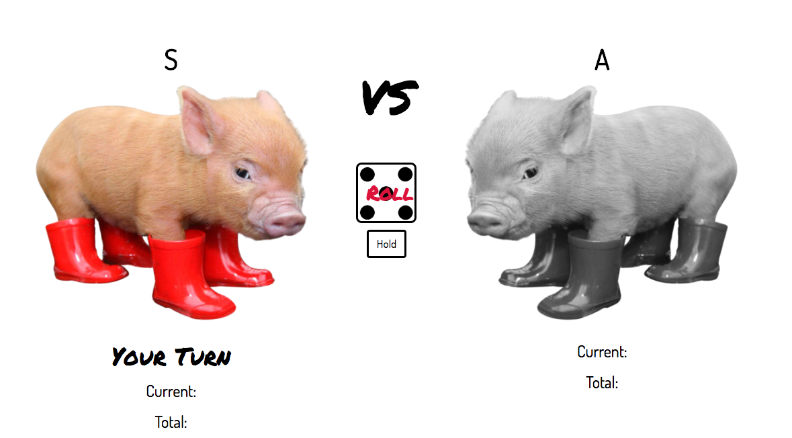

# Pig Dice

#### By _**Joanna Anderson and Sandro Alvarez**_

## Description

This is a computer version of the classic game Pig Dice. The application allows users to play against another player or against a computer.

**The rules**
Each turn, a player repeatedly rolls a die until either a 1 is rolled or the player decides to "hold". First player to 100 points wins the game.

## Setup/Installation Requirements

* Run `$git clone https://github.com/saeromjoa/pig-dice`
* Open index.html

## Technologies Used

_HTML,
CSS,
JavaScript,
Bootstrap_

### License

*This webpage is licensed under the MIT license.*

Copyright (c) 2016 **_Sandro Alvarez and Joanna Anderson_**
